# Multi-Agent Ticket Classification Architecture

## System Architecture

```mermaid
graph TB
    subgraph "User Interface"
        UI[Streamlit Dashboard<br/>4 Tabs]
        UI --> TAB1[Quick Classify]
        UI --> TAB2[6-Phase Classification]
        UI --> TAB3[Batch Processing]
        UI --> TAB4[🤖 AI Agent Assistant]
    end
    
    subgraph "AI Agent Assistant Flow"
        TAB4 --> INPUT[User Input<br/>Ticket Description]
        INPUT --> AGENT1[🎯 Classification Agent]
        INPUT --> AGENT2[📊 Metadata Agent]
        INPUT --> AGENT3[📚 Knowledge Base Agent]
        INPUT --> AGENT4[🔍 Historical Agent]
    end
    
    subgraph "Unity Catalog Functions"
        AGENT1 --> UC1[ai_classify<br/>Category/Priority/Team]
        AGENT2 --> UC2[ai_extract<br/>Priority Score/Urgency/Systems]
    end
    
    subgraph "Vector Search"
        AGENT3 --> VS[Vector Search Index<br/>knowledge_base_index]
        VS --> EMBED[BGE Embeddings]
        VS --> KB[(Knowledge Base<br/>12 Documents)]
    end
    
    subgraph "Genie"
        AGENT4 --> GENIE[Genie Conversation API]
        GENIE --> HIST[(ticket_history<br/>30 Sample Tickets)]
    end
    
    subgraph "Foundation Model"
        UC1 --> LLM[Llama 3.3 70B<br/>Instruct]
        UC2 --> LLM
        GENIE --> LLM
    end
    
    subgraph "Results Aggregation"
        UC1 --> AGG[Results Aggregator]
        UC2 --> AGG
        VS --> AGG
        GENIE --> AGG
        
        AGG --> REC[Smart Recommendations<br/>Generator]
        REC --> EXPORT[JSON Export]
        REC --> DISPLAY[UI Display]
    end
    
    style TAB4 fill:#e1f5ff
    style AGENT1 fill:#fff4e6
    style AGENT2 fill:#fff4e6
    style AGENT3 fill:#fff4e6
    style AGENT4 fill:#fff4e6
    style LLM fill:#f3e5f5
    style AGG fill:#e8f5e9
```

## Agent Coordination Flow

```mermaid
sequenceDiagram
    participant User
    participant Dashboard
    participant Agent1 as 🎯 Classification Agent
    participant Agent2 as 📊 Metadata Agent
    participant Agent3 as 📚 KB Agent
    participant Agent4 as 🔍 History Agent
    participant UC as Unity Catalog
    participant VS as Vector Search
    participant Genie as Genie API
    
    User->>Dashboard: Enter ticket & click Analyze
    Dashboard->>Dashboard: Show status: "Agent Processing..."
    
    par Parallel Execution
        Dashboard->>Agent1: Classify ticket
        Agent1->>UC: CALL ai_classify(ticket_text)
        UC-->>Agent1: {category, priority, team}
        Agent1-->>Dashboard: ✅ Classification (1-2s)
        
        Dashboard->>Agent2: Extract metadata
        Agent2->>UC: CALL ai_extract(ticket_text)
        UC-->>Agent2: {priority_score, urgency, systems}
        Agent2-->>Dashboard: ✅ Metadata (1-2s)
        
        Dashboard->>Agent3: Search knowledge base
        Agent3->>VS: POST /query {query_text}
        VS-->>Agent3: {documents[]}
        Agent3-->>Dashboard: ✅ KB Results (500ms)
    end
    
    Note over Dashboard: Build intelligent Genie query<br/>based on classification
    
    Dashboard->>Agent4: Query historical tickets
    Agent4->>Genie: POST /start-conversation
    Genie-->>Agent4: {conversation_id, message_id}
    
    loop Poll every 5s (max 120s)
        Agent4->>Genie: GET /messages/{message_id}
        Genie-->>Agent4: {status: IN_PROGRESS}
    end
    
    Genie-->>Agent4: {status: COMPLETED, attachments}
    Agent4-->>Dashboard: ✅ Historical data (15-30s)
    
    Dashboard->>Dashboard: Aggregate all results
    Dashboard->>Dashboard: Generate recommendations
    Dashboard->>User: Display comprehensive analysis
    User->>Dashboard: Export JSON (optional)
```

## Data Flow Architecture

## Technology Stack

## Agent Decision Tree

## Cost & Performance Breakdown

## Deployment Architecture

## Key Metrics Dashboard

| Metric | Without Genie | With Genie |
|--------|--------------|------------|
| **Total Execution Time** | 2-4 seconds | 20-35 seconds |
| **Classification Time** | 1-2 seconds | 1-2 seconds |
| **Metadata Extraction** | 1-2 seconds | 1-2 seconds |
| **Vector Search** | 500ms | 500ms |
| **Genie Query** | N/A | 15-30 seconds |
| **Total Cost** | $0.001 | $0.002 |
| **Agents Invoked** | 3 | 4 |

## Success Criteria

✅ **Performance**
- Classification completes in < 3s (without Genie)
- Vector Search returns results in < 1s
- Genie queries complete in < 60s (typical)

✅ **Accuracy**
- Classification matches expected categories 95%+
- Priority scoring aligns with severity
- Knowledge base returns relevant docs 90%+

✅ **Reliability**
- System handles warehouse cold start (30-60s)
- Graceful fallback if Genie times out
- Error handling for all API calls

✅ **User Experience**
- Real-time status updates
- Clear error messages
- Export functionality works
- Mobile-responsive UI

✅ **Cost Efficiency**
- < $0.002 per ticket analyzed
- Reuses warehouse connections
- Caches Databricks client

## Monitoring & Observability

---

## Summary

This architecture provides:

🎯 **Modular Design** - Each agent is independent and can be updated separately

⚡ **Parallel Execution** - Classification, extraction, and search run simultaneously

🔄 **Fault Tolerance** - Graceful degradation if any agent fails

📊 **Observable** - Detailed logging and metrics at each stage

💰 **Cost-Effective** - ~$0.002 per ticket with predictable pricing

🚀 **Scalable** - Can process thousands of tickets per hour

🔒 **Secure** - Uses Databricks authentication and Unity Catalog governance

---

**Next Steps:**
1. Review deployed dashboard
2. Test with various ticket types
3. Monitor performance metrics
4. Gather user feedback
5. Plan Phase 2 enhancements

